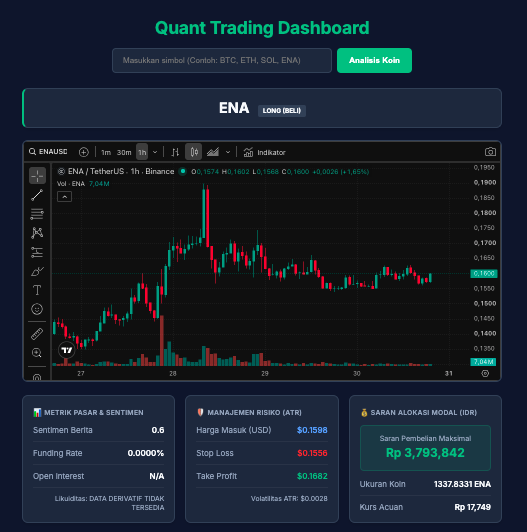

# Quantitative Crypto Market Analyst & Signal Engine

An autonomous, multi-agent quantitative cryptocurrency market intelligence and advisory system built with LangGraph, Google Gemini, and algorithmic technical indicators.

<p align="center">
  
</p>

Designed strictly as a non-execution, analytical engine, this platform continuously monitors crypto asset pairs, evaluates multi-timeframe structural trends, processes macroeconomic sentiment, computes directional probabilities, and calculates volatility-adjusted risk levels (ATR). Actionable trading setups meeting strict statistical confidence thresholds are instantly dispatched to Telegram and visualized on the web dashboard.

---

## Technology Stack

### Programming Language & Runtime
* **Python 3.11**: Core runtime environment.

### Multi-Agent Orchestration
* **LangGraph (`langgraph`)**: Deterministic state machine and directed acyclic graph (DAG) execution framework via `StateGraph` for structured inter-agent data flow.

### Artificial Intelligence & Reasoning
* **Google GenAI SDK (`google-genai`)**: Integration with Gemini Flash for technical synthesis, market context confirmation, and headline sentiment analysis.

### Quantitative Analysis & Mathematics
* **Pandas & NumPy**: Vectorized operations, time-series data cleansing, resampling, and OHLCV matrix calculations.
* **Technical Analysis Library (`ta`)**: Mathematical computation of core indicators including Exponential Moving Averages (EMA 9/21/50), Relative Strength Index (RSI), and Average True Range (ATR).

### Market Data Ingestion & Derivatives
* **Binance Futures API & Twelve Data**: Real-time market feed, funding rates, and open interest metrics.
* **Yahoo Finance (`yfinance`)**: Secondary fallback feed ensuring continuous historical time-series retrieval.

### Interface & Operational Alerting
* **Flask Web Dashboard**: Responsive UI for manual token analysis, interactive charting, and quantitative risk breakdown.
* **Telegram Bot API**: Programmatic delivery of structured market intelligence reports, trade parameters, and risk sizing via HTTPS POST.

---

## Core Characteristics

* **Pure Advisory Architecture:** Zero order execution risk. The system does not interface with exchange execution endpoints or private trading keys, focusing strictly on data integrity, anomaly detection, and probability quantification.
* **Dual-Timeframe Quantitative Confluence:**
  * **Higher Timeframe Regime Filter:** Identifies overarching trend structure relative to EMA 50.
  * **Lower Timeframe Execution Momentum:** Validates short-term momentum triggers via EMA 9/21 crossovers and Fast RSI mean-reversion boundaries.
* **Dynamic Volatility & Risk Sizing:** Invalidation levels (Stop Loss), profit targets (Take Profit), and position allocations are calculated dynamically using the 14-period Average True Range (ATR), adapting automatically to shifting market volatility.
* **Dual-Channel Distribution:** Real-time visualization via local web dashboard and push notifications dispatched via Telegram Bot.

---

## System Workflow

```text
               +-------------------------------------------------+
               |             Market Data Ingestion               |
               |        (Binance API / Twelve Data / YFinance)   |
               +-------------------------------------------------+
                                        |
                                        v
+------------------+         +---------------------+         +---------------------+
|  History Agent   | ------> |     Macro Agent     | ------> |   Technical Agent   |
|  Fetches Multi-  |         |  Scans & Analyzes   |         |  TA Computation &   |
|  Timeframe OHLCV |         |  News Sentiment     |         |  Gemini Synthesis   |
+------------------+         +---------------------+         +---------------------+
                                                                        |
                                                                        v
+------------------+         +---------------------+         +---------------------+
|   Notify Agent   | <------ |    Logger Agent     | <------ |     Risk Agent      |
|  Dispatches to   |         |  Archives Signal to |         |  Calculates ATR,    |
|  Telegram Bot    |         |  SQLite Database    |         |  SL, TP & Sizing    |
+------------------+         +---------------------+         +---------------------+
